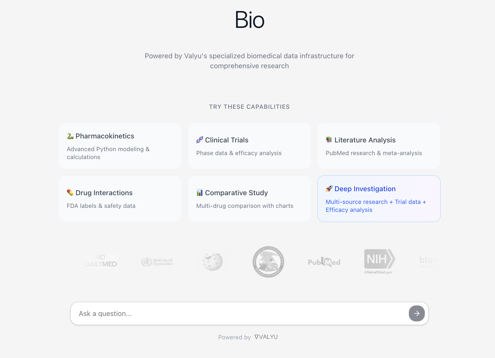

# Bio

Try the hosted version [here](https://bio.valyu.ai) 🙌  

Then fork and get building...

> **Enterprise-grade biomedical research behind a chat interface** - Access PubMed, clinical trials, FDA drug labels, and run complex Python analyses through natural language. Powered by specialized biomedical data APIs.



## Why Bio?

Traditional biomedical research is fragmented across dozens of databases and platforms. Bio changes everything by providing:

- **Comprehensive Medical Data** - PubMed articles, ClinicalTrials.gov data, FDA drug labels, and more
- **One Unified Search** - Powered by Valyu's specialized biomedical data API
- **Advanced Analytics** - Execute Python code in secure Daytona sandboxes for statistical analysis, pharmacokinetic modeling, and custom calculations
- **Interactive Visualizations** - Beautiful charts and dashboards for clinical data
- **Real-Time Intelligence** - Web search integration for breaking medical news
- **Local AI Models** - Run with Ollama or LM Studio for unlimited, private queries using your own hardware
- **Natural Language** - Just ask questions like you would to a colleague

## Key Features

### Powerful Biomedical Tools

- **PubMed & ArXiv Search** - Access to millions of scientific papers and biomedical research
- **Clinical Trials Database** - Search ClinicalTrials.gov for active and completed trials
- **FDA Drug Labels** - Access comprehensive drug information from DailyMed
- **Drug Information** - Detailed medication data, warnings, and contraindications
- **Interactive Charts** - Visualize clinical data, drug efficacy, patient outcomes
- **Python Code Execution** - Run pharmacokinetic calculations, statistical analyses, and ML models

### Advanced Tool Calling

- **Python Code Execution** - Run complex biomedical calculations, statistical tests, and data analysis
- **Interactive Charts** - Create publication-ready visualizations of clinical data
- **Multi-Source Research** - Automatically aggregates data from multiple biomedical sources
- **Export & Share** - Download results, share analyses, and collaborate

## Quick Start (Self-Hosted)

Self-hosted mode is the recommended way to run Bio. It provides a complete local environment with:
- **No authentication required** - Auto-login as dev user
- **Local SQLite database** - No external database setup needed
- **Unlimited queries** - No rate limits
- **Ollama/LM Studio support** - Use local LLMs for privacy and unlimited usage

### Prerequisites

- Node.js 18+
- npm or yarn
- Valyu API key (get one at [platform.valyu.ai](https://platform.valyu.ai))
- Daytona API key (for code execution)
- [Ollama](https://ollama.com) or [LM Studio](https://lmstudio.ai) installed (optional but recommended)

### Installation

1. **Clone the repository**
   ```bash
   git clone https://github.com/yorkeccak/bio.git
   cd bio
   ```

2. **Install dependencies**
   ```bash
   npm install
   ```

3. **Set up environment variables**

   Create a `.env.local` file in the root directory:

   ```env
   # Enable Self-Hosted Mode
   NEXT_PUBLIC_APP_MODE=self-hosted

   # Valyu API Configuration (Required)
   VALYU_API_KEY=your-valyu-api-key

   # Daytona Configuration (Required for Python execution)
   DAYTONA_API_KEY=your-daytona-api-key
   DAYTONA_API_URL=https://api.daytona.io
   DAYTONA_TARGET=latest

   # Local LLM Configuration (Optional - for unlimited, private queries)
   OLLAMA_BASE_URL=http://localhost:11434   # Default Ollama URL
   LMSTUDIO_BASE_URL=http://localhost:1234  # Default LM Studio URL

   # OpenAI Configuration (Optional - fallback if local models unavailable)
   OPENAI_API_KEY=your-openai-api-key
   ```

4. **Run the development server**
   ```bash
   npm run dev
   ```

5. **Open your browser**

   Navigate to [http://localhost:3000](http://localhost:3000)

   You'll be automatically logged in as `dev@localhost` with full access to all features.

## Self-Hosted Mode Guide

### What is Self-Hosted Mode?

Self-hosted mode provides a complete local environment without any external dependencies beyond the core APIs (Valyu, Daytona). It's perfect for:

- **Local Development** - No Supabase setup required
- **Offline Work** - All data stored locally in SQLite
- **Testing Features** - Unlimited queries without billing
- **Privacy** - Use local Ollama models, no cloud LLM needed
- **Quick Prototyping** - No authentication or rate limits

### How It Works

When `NEXT_PUBLIC_APP_MODE=self-hosted`:

1. **Local SQLite Database** (`/.local-data/dev.db`)
   - Automatically created on first run
   - Stores chat sessions, messages, charts, and CSVs
   - Full schema matching production tables
   - Easy to inspect with `sqlite3 .local-data/dev.db`

2. **Mock Authentication**
   - Auto-login as dev user (`dev@localhost`)
   - No sign-up/sign-in required
   - Unlimited tier access with all features

3. **No Rate Limits**
   - Unlimited chat queries
   - No usage tracking
   - No billing integration

4. **LLM Selection**
   - **Ollama models** (if installed) - Used first, unlimited and free
   - **LM Studio models** (if installed) - Alternative local option with GUI
   - **OpenAI** (if API key provided) - Fallback if no local models available
   - See local models indicator in top-right corner with provider switching

### Setting Up Ollama (Recommended)

Ollama provides unlimited, private LLM inference on your local machine - completely free and runs offline!

**Quick Setup:**

1. **Download Ollama App**
   - Visit [ollama.com](https://ollama.com) and download the app for your OS
   - Install and open the Ollama app
   - It runs in your menu bar (macOS) or system tray (Windows/Linux)

2. **Download a Model**
   - Open Ollama app and browse available models
   - Download `qwen2.5:7b` (recommended - best for biomedical research with tool support)
   - Or choose from: `llama3.1`, `mistral`, `deepseek-r1`
   - That's it! Bio will automatically detect and use it

3. **Use in Bio**
   - Start the app in self-hosted mode
   - Ollama status indicator appears in top-right corner
   - Shows your available models
   - Click to select which model to use

**Terminal Setup (Advanced):**

```bash
# Install Ollama
brew install ollama              # macOS
# OR
curl -fsSL https://ollama.com/install.sh | sh  # Linux

# Start Ollama service
ollama serve

# Download recommended models
ollama pull qwen2.5:7b          # Recommended - excellent tool support
ollama pull llama3.1:8b         # Alternative - good performance
```

### Setting Up LM Studio (Alternative)

LM Studio provides a beautiful GUI for running local LLMs - perfect if you prefer visual interfaces over terminal commands!

1. **Download LM Studio** from [lmstudio.ai](https://lmstudio.ai)
2. **Download Models** - Search for `qwen/qwen3-14b` or `google/gemma-3-12b`
3. **Start the Server** - Click LM Studio menu bar icon -> "Start Server on Port 1234..."
4. **Configure Context Window** - Set to at least 8192 tokens (16384+ recommended)

### Managing Local Database

**View Database:**
```bash
sqlite3 .local-data/dev.db
# Then run SQL queries
SELECT * FROM chat_sessions;
SELECT * FROM charts;
```

**Reset Database:**
```bash
rm -rf .local-data/
# Database recreated on next app start
```

## Valyu Mode (OAuth Coming Soon)

> **Note:** Valyu OAuth apps will be in general availability soon. Currently client id/secret are not publicly available. Contact contact@valyu.ai if you need access.

Valyu mode provides:
- Full authentication via Valyu Platform OAuth
- Supabase for persistent data storage
- Usage tracking and billing via Valyu Platform
- Rate limiting based on subscription tier

For Valyu mode setup, set `NEXT_PUBLIC_APP_MODE=valyu` and configure the OAuth credentials. See `.env.example` for the full list of required variables.

## Example Queries

Try these powerful queries to see what Bio can do:

- "What are the latest clinical trials for CAR-T therapy in melanoma?"
- "Find recent PubMed papers on CRISPR gene editing safety"
- "Calculate the half-life of warfarin based on these concentrations"
- "Search for drug interactions between metformin and lisinopril"
- "Analyze Phase 3 clinical trial data for immunotherapy drugs"
- "Create a chart comparing efficacy rates of different COVID-19 vaccines"

**With Local Models (Ollama/LM Studio):**
- Run unlimited queries without API costs
- Keep all your medical research completely private
- Perfect for sensitive patient data analysis
- Choose your preferred interface: terminal (Ollama) or GUI (LM Studio)

## Architecture

- **Frontend**: Next.js 15 with App Router, Tailwind CSS, shadcn/ui
- **AI**: OpenAI GPT-5 with function calling + Ollama/LM Studio for local models
- **Data**: Valyu API for comprehensive biomedical data
- **Code Execution**: Daytona sandboxes for secure Python execution
- **Visualizations**: Recharts for interactive charts
- **Real-time**: Streaming responses with Vercel AI SDK
- **Local Models**: Ollama and LM Studio integration for private, unlimited queries

## Security

- Secure API key management
- Sandboxed code execution via Daytona
- No storage of sensitive medical data
- HTTPS encryption for all API calls
- HIPAA-compliant architecture (when self-hosted)

## License

This project is licensed under the MIT License - see the [LICENSE](LICENSE) file for details.

## Contributing

Contributions are welcome! Please feel free to submit a Pull Request.

## Acknowledgments

- Built with [Valyu](https://platform.valyu.ai) - The unified biomedical data API
- Powered by [Daytona](https://daytona.io) - Secure code execution
- UI components from [shadcn/ui](https://ui.shadcn.com)

---

<p align="center">
  Made with love for biomedical researchers
</p>

<p align="center">
  <a href="https://twitter.com/valyuOfficial">Twitter</a> -
  <a href="https://www.linkedin.com/company/valyu-ai">LinkedIn</a> -
  <a href="https://github.com/yorkeccak/bio">GitHub</a>
</p>
