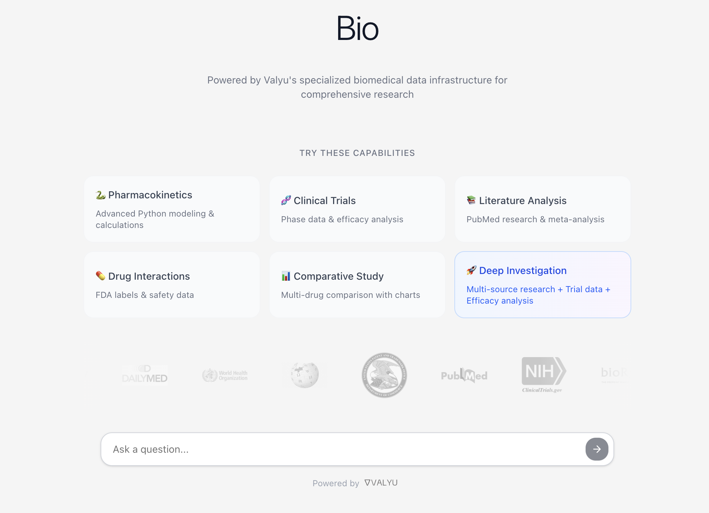

<p align="center">
  <a href="https://github.com/yorkeccak/bio/stargazers"></a>
  <a href="https://github.com/yorkeccak/bio/blob/main/LICENSE"></a>
  <a href="https://github.com/yorkeccak/bio/network/members"></a>
  <a href="https://github.com/yorkeccak/bio/graphs/contributors"></a>
</p>

# Bio

Try the hosted version [here](https://bio.valyu.ai) 🙌

Then fork and get building...

> **Enterprise-grade biomedical deep research** - Pick a life sciences workflow, fill in a few variables, and get back a cited research report with deliverables. Powered by Valyu DeepResearch over PubMed, ClinicalTrials.gov, FDA drug labels, patents, and the open web.



## Why Bio?

Biomedical evidence is fragmented across dozens of databases, and stitching it together by hand is where the days go. Bio runs the whole search-read-synthesise loop for you:

- **Prebuilt life sciences workflows** - Competitive landscapes, clinical readouts, regulatory precedent, and business development scans, each with typed inputs instead of a blank prompt box
- **Comprehensive biomedical data** - PubMed articles, ClinicalTrials.gov records, FDA drug labels, patents, and more through Valyu's unified API
- **Cited reports** - Every claim carries an inline citation that resolves to the underlying source
- **Deliverables** - Structured artifacts alongside the narrative, plus PDF export
- **Example reports** - Real finished reports per domain, so you can see the output before spending a credit
- **Self-hostable** - Local SQLite, no authentication, no rate limits

## Key Features

### Deep research reports

- **Workflow browser** - Browse the life sciences workflow catalog by lens: Pipeline & Assets, Clinical, Regulatory, and Business Development
- **Three research modes** - `fast`, `standard`, and `heavy`, trading depth against turnaround time
- **Live activity feed** - Watch the searches, reads, and reasoning steps as the report is built
- **Report history** - Every report is stored and re-openable, with cancel and sync controls while a run is in flight

### Reading and sharing

- **Inline citations** - Hover any marker for the source title, date, and link
- **Images and deliverables** - Charts and structured outputs rendered next to the report body
- **PDF export** - Server-rendered PDF of any completed report
- **Share links** - Send a report to a colleague or post it

### Example reports

Each domain ships with a seeded example report so the app is useful before you have run anything yourself. They render through the same report view as live output.

## Quick Start (Self-Hosted)

Self-hosted mode is the recommended way to run Bio. It provides a complete local environment with:

- **No authentication required** - Auto-login as dev user
- **Local SQLite database** - No external database setup needed
- **No rate limits** - Credits are handled by your own Valyu API key

### Prerequisites

- Node.js 18+
- pnpm (`npm install -g pnpm`)
- Valyu API key (get one at [platform.valyu.ai](https://platform.valyu.ai))

### Installation

1. **Clone the repository**

   ```bash
   git clone https://github.com/yorkeccak/bio.git
   cd bio
   ```

2. **Install dependencies**

   ```bash
   pnpm install
   ```

3. **Set up environment variables**

   Create a `.env.local` file in the root directory:

   ```env
   # Enable Self-Hosted Mode
   NEXT_PUBLIC_APP_MODE=self-hosted

   # Valyu API Configuration (Required)
   VALYU_API_KEY=your-valyu-api-key

   # OpenAI Configuration (Optional - used to suggest report deliverables)
   OPENAI_API_KEY=your-openai-api-key

   # Local model servers (Optional - powers the local model status indicator)
   OLLAMA_BASE_URL=http://localhost:11434   # Default Ollama URL
   LMSTUDIO_BASE_URL=http://localhost:1234  # Default LM Studio URL
   ```

4. **Run the development server**

   ```bash
   pnpm dev
   ```

5. **Open your browser**

   Navigate to [http://localhost:3000](http://localhost:3000)

   You'll be automatically logged in as `dev@localhost` with full access to all features.

## Self-Hosted Mode Guide

### What is Self-Hosted Mode?

Self-hosted mode provides a complete local environment without any external dependencies beyond the Valyu API. It's perfect for:

- **Local Development** - No Supabase setup required
- **Testing Features** - No auth wall between you and the app
- **Privacy** - Reports and user data stay on your machine
- **Quick Prototyping** - No authentication or rate limits

### How It Works

When `NEXT_PUBLIC_APP_MODE=self-hosted`:

1. **Local SQLite Database** (`/.local-data/dev.db`)
   - Automatically created on first run
   - Stores the local user record
   - Easy to inspect with `sqlite3 .local-data/dev.db`

2. **Mock Authentication**
   - Auto-login as dev user (`dev@localhost`)
   - No sign-up/sign-in required

3. **No Rate Limits**
   - Usage is governed by the credits on your own Valyu API key

### Local Model Servers (Optional)

Bio detects [Ollama](https://ollama.com) and [LM Studio](https://lmstudio.ai) running on your machine and surfaces their status and available models in the top-right indicator.

**Ollama:**

```bash
# Install Ollama
brew install ollama              # macOS
# OR
curl -fsSL https://ollama.com/install.sh | sh  # Linux

# Start Ollama service
ollama serve

# Download a model
ollama pull qwen2.5:7b
```

**LM Studio:**

1. **Download LM Studio** from [lmstudio.ai](https://lmstudio.ai)
2. **Download a model** - Search for `qwen/qwen3-14b` or `google/gemma-3-12b`
3. **Start the server** - Click the LM Studio menu bar icon -> "Start Server on Port 1234..."
4. **Configure the context window** - Set to at least 8192 tokens (16384+ recommended)

### Managing Local Database

**View Database:**

```bash
sqlite3 .local-data/dev.db
# Then run SQL queries
SELECT * FROM users;
```

**Reset Database:**

```bash
rm -rf .local-data/
# Database recreated on next app start
```

## Valyu Mode (Optional)

Valyu mode adds hosted authentication and billing: users sign in with their Valyu account through OAuth, and research runs are charged against their Valyu credits rather than a shared API key.

### Prerequisites for Valyu Mode

- Valyu OAuth credentials (contact contact@valyu.ai)
- A Supabase project for your app's own user data

### Valyu Mode Configuration

```env
# Enable Valyu Mode
NEXT_PUBLIC_APP_MODE=valyu

# Valyu OAuth Credentials (contact contact@valyu.ai)
NEXT_PUBLIC_VALYU_SUPABASE_URL=https://your-valyu-supabase-url
NEXT_PUBLIC_VALYU_CLIENT_ID=your-client-id
VALYU_CLIENT_SECRET=your-client-secret
VALYU_APP_URL=https://platform.valyu.ai

# Your App's Supabase (for user data)
NEXT_PUBLIC_SUPABASE_URL=https://your-project.supabase.co
NEXT_PUBLIC_SUPABASE_ANON_KEY=your-anon-key
SUPABASE_SERVICE_ROLE_KEY=your-service-role-key

# Optional fallback key for anonymous traffic
VALYU_API_KEY=your-valyu-api-key
```

## Example Reports

Bio ships with a seeded example report for each life sciences lens:

- **Pipeline & Assets** - Competitive landscape across a target class
- **Clinical** - Trial landscape and readout analysis
- **Regulatory** - Approval pathway and precedent scan
- **Business Development** - Partnering and asset opportunity scan

Open one from the reports page to see the report view, citations, and deliverables without running a workflow.

## Architecture

- **Frontend**: Next.js 15 with App Router, Tailwind CSS v4, shadcn/ui
- **Research**: Valyu DeepResearch workflows over biomedical and web sources
- **Auth**: Valyu OAuth in valyu mode, local dev user in self-hosted mode
- **Storage**: Supabase in valyu mode, SQLite via Drizzle in self-hosted mode
- **PDF**: Puppeteer with `@sparticuz/chromium`
- **Analytics**: PostHog and Vercel Analytics

## Deploy to Vercel

The quickest way to get Bio running in production:

1. **Fork this repository** to your GitHub account
2. **Create a new project** on [vercel.com](https://vercel.com) and import your fork
3. **Add environment variables** in Vercel project settings (Settings > Environment Variables):
   - `NEXT_PUBLIC_APP_MODE` = `self-hosted`
   - `VALYU_API_KEY` = your Valyu API key
   - `OPENAI_API_KEY` = your OpenAI API key (optional, for deliverable suggestions)
4. **Deploy** - Vercel handles the rest

[](https://vercel.com/new/clone?repository-url=https%3A%2F%2Fgithub.com%2Fyorkeccak%2Fbio&env=NEXT_PUBLIC_APP_MODE,VALYU_API_KEY,OPENAI_API_KEY&envDescription=API%20keys%20needed%20for%20Bio&envLink=https%3A%2F%2Fgithub.com%2Fyorkeccak%2Fbio%23quick-start-self-hosted)

## Security

- Secure API key management
- No storage of sensitive medical data
- HTTPS encryption for all API calls

## License

This project is licensed under the MIT License - see the [LICENSE](LICENSE) file for details.

## Contributing

Contributions are welcome! Here's how to get started:

1. Fork the repository
2. Create a feature branch (`git checkout -b feature/your-feature`)
3. Make your changes
4. Run `pnpm dev` and test locally
5. Commit your changes and push to your fork
6. Open a Pull Request against `main`

For bugs or feature requests, [open an issue](https://github.com/yorkeccak/bio/issues) or start a [discussion](https://github.com/yorkeccak/bio/discussions).

## Acknowledgments

- Built with [Valyu](https://platform.valyu.ai) - The unified biomedical data API
- UI components from [shadcn/ui](https://ui.shadcn.com)

---

<p align="center">
  Made with love for biomedical researchers
</p>

<p align="center">
  <a href="https://twitter.com/valyuOfficial">Twitter</a> -
  <a href="https://www.linkedin.com/company/valyu-ai">LinkedIn</a> -
  <a href="https://github.com/yorkeccak/bio">GitHub</a>
</p>
